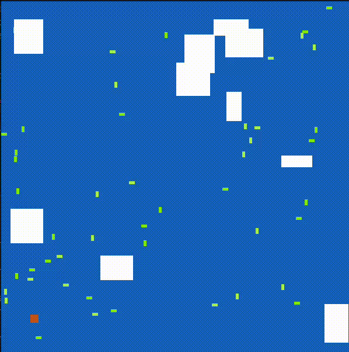

# Arctic Game
Jeu réalisé dans le cadre du cours d'introduction a la POO en L2 Informatique à l'Université Vandoeuvre les Nancy. En java

## Installation
Pour installer le jeu, il suffit de cloner le projet et de le lancer avec le terminal de commande en etant dans la racine du projet.

```bash ./glaces/start.sh```

## Image du jeu

